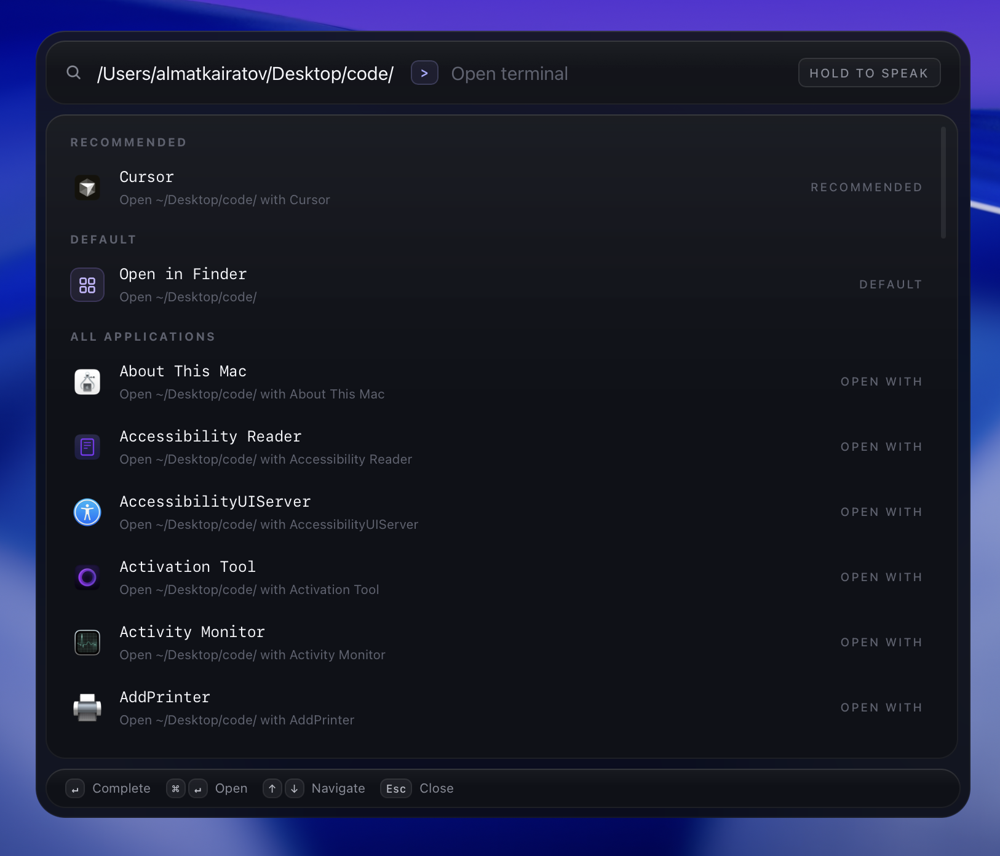

# Tezbar

Tezbar is a desktop command surface for search, AI help, terminal access, notes, snippets, and a handful of small utility tools. It is built for a keyboard-first workflow and aims to keep the common stuff in one place.

## What's in the app

- Command bar for launching actions quickly
- AI chat and agent-style workflows
- Embedded terminal
- Notes and snippets
- Local Knowledge indexing for document text, PDFs, and image OCR, shared by the Command Bar and AI agent
- Emoji picker
- Currency and calculator helpers
- Extension browsing and execution (Raycast extensions supported)
- Voice input and text-to-speech
- System commands (platform-dependent)
- **Folder search** — type `/` to quickly navigate into any folder and open it in your preferred app or open a terminal directly in that directory
  

## Tech Stack

- Tauri + Vite for the main desktop app
- React + TypeScript for the UI
- Rust, Swift, and native helpers for platform features
- SQLite for local persistence and search

## Requirements

- macOS or Windows 10/11
- [pnpm](https://pnpm.io/)
- Homebrew for optional macOS native dependencies
- Rust toolchain for native modules

## Setup

```bash
pnpm install
pnpm build:native
pnpm dev
```

`pnpm build:native` builds the Swift helpers on macOS and safely does nothing
on Windows.

## Useful Scripts

- `pnpm dev` - start the Tauri app in development mode
- `pnpm build` - build and package the Tauri app for the current platform
- `pnpm build:windows` - build Windows NSIS and MSI installers (run on Windows)
- `pnpm build:native` - build native helpers
- `pnpm dist` - build and package the Tauri app
- `pnpm tauri:dev` - build the backend and run the Tauri app in dev mode
- `pnpm tauri:build` - build the backend and package the Tauri app

## Windows support status

### Working in the Tauri app

- Launcher UI, hotkey (`Alt+Space` by default), AI chat, notes, snippets,
  calculator, currency, emoji picker, extensions, and voice UI.
- Built-in PowerShell terminal through Windows ConPTY.
- Search and launch applications from Start Menu shortcuts.
- Clipboard history for text and images.
- Open Ports using `netstat.exe`, with process names resolved through
  `tasklist.exe`.
- Windows system helpers: dark mode, lock screen, suspend, keep-awake,
  volume up/down/mute, Downloads, network, CPU, memory, disk, and battery
  information. Wi-Fi adapter toggling asks for Windows UAC confirmation.
- Windows packaging command: `pnpm build:windows`.

### Remaining work for a full Windows port

- Replace the Swift OCR helper with a Windows-native implementation.
- Add Windows UI-automation/accessibility tree support for semantic agent actions.
- Port extensions that directly depend on arbitrary AppleScript when a meaningful
  Windows equivalent exists.
- Add native Windows clipboard file-list support and installed-app icons.
- Complete and test a signed Windows installer build in CI.

See [`docs/WINDOWS_SUPPORT.md`](docs/WINDOWS_SUPPORT.md) for the detailed
platform mapping and remaining native parity work.

## Tauri Builds

Tauri is configured separately in [`src-tauri/tauri.conf.json`](/Users/almatkairatov/Desktop/code/Raymes/src-tauri/tauri.conf.json). It uses the app’s branded icon set and can produce macOS DMG output.

To build the Tauri app:

```bash
pnpm tauri:build
```

The macOS DMG is emitted under:

```text
src-tauri/target/release/bundle/dmg/
```

## Icon Assets

The Electron build uses the branded icon files in [`build/`](/Users/almatkairatov/Desktop/code/Raymes/build). Tauri now uses the same source artwork, so both builds should present Tezbar branding instead of the default placeholder icon.

## Notes

- The app’s current package manager is `pnpm`.
- Windows supports the launcher UI, search, Start Menu applications, terminal,
  clipboard text/images, Open Ports, the interactive color picker, and the
  cross-platform system helpers. AppleScript, Finder automation, macOS
  accessibility snapshots, and the Swift OCR helper remain macOS-only.
- The primary app flow is Tauri/Vite with a bundled TypeScript backend.
- If macOS Finder shows an old app icon after rebuilding, that is usually icon cache lag rather than a bad build.
